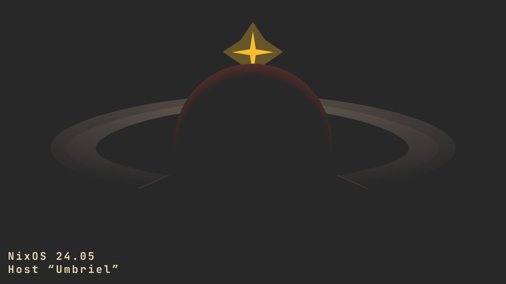

 
<h1>My NixOS configuration</h1>

Simple configuration, made by dreamer

<b>Version of NixOS 24.11, gruvbox styled</b>

## Structure

In `modules` setting upped services and de/wm

In `packages` custom packages, and `source.nix` `umbriel.nix` that files contains packages, `source.nix` for Eos and Aether (contains all packages I need), and `umbriel.nix` only for server

In `home-manager` custom configs and packages for user, and and the same files `source.nix` and `umbriel.nix`.

In `machines` machines configuration files

## Machines

This configuration is not finished yet.

### Aether

This is my PC Configuration, with plasma6

`I should definitely make the plasma6 configuration reproducible`

Now uses custom kernel ([xanmod](https://xanmod.org/)) which compiles

### Eos

For my laptop, still not written...

### Umbriel

For my new home server.

Uses dwm, and minimal set of programs

## Usage

1. Generate configuration

   This is necessary for Nix to create `hardware-configuration.nix`

2. Clone repository, and change `configuration.nix`

   Copy your `hardware-configuration.nix` to path of the selected machine

3. And build with flag `--flake .#<machine>`!

**If you find bug or something like that, create issue on this repository!**

_If, of course, this configuration will be useful to someone.._

## Wallpapers

I made some wallpapers for all machines.

<a href="./stuff/wallpapers/svg">Link to svg</a>

  
Full HD Wallpapers

Yeah wallpapers on server. Why not?

**All these wallpapers you can use anywhere!**

## License

[MIT License](./LICENSE.txt)
