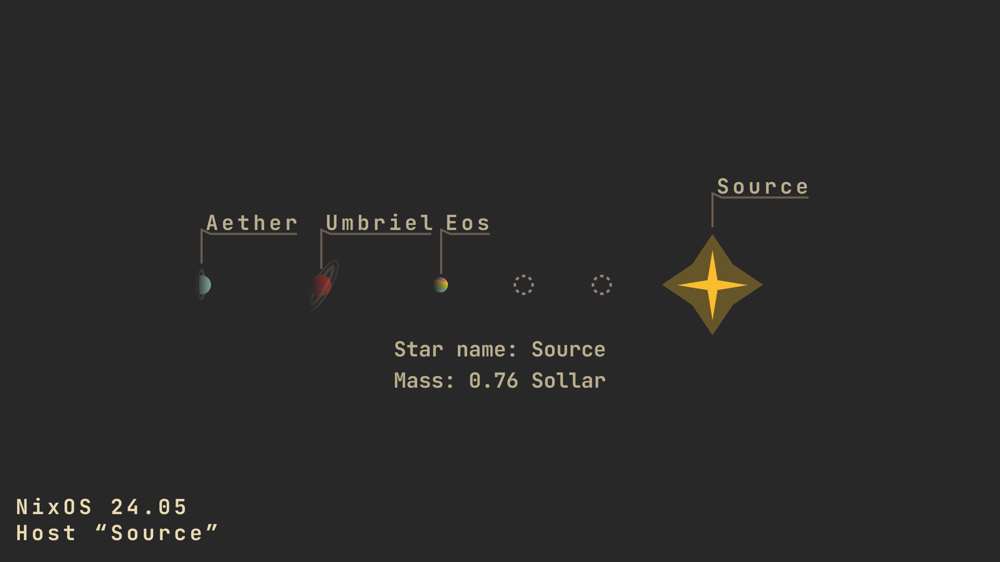

<div align="center"> 
<h1>My NixOS configuration</h1>

<p>Simple configuration, maded by dreamer</p>
<b>Version of NixOS 24.05, gruvbox styled</b>
</div>

## Machines

This configuration is not finished yet. And i configured only for my PC:

### Source

Essentially the most standard configuration, only with all the programs I need, without a specific DE

### Aether

PC Configuration, with plasma6

`I should definitely make the plasma6 configuration reproducible`

### Eos

For my laptop, still not written...

## Usage

1. Generate configuration

   This is necessary for Nix to create `hardware-configuraiton.nix`

2. Clone repository, and change `configuration.nix`

```nix
{
  imports = [
    ./machines/<machine name config>
  ];
}
```

3. Don't forget change in `flake.nix` this line:

```nix
18 | 		nixosConfigurations.aether = nixpkgs.lib.nixosSystem {
```

to

```nix
18 | 		nixosConfigurations.<machine name config> = nixpkgs.lib.nixosSystem {
```

3. And build!

**If you find bug or something like that, create issue on this repository!**

_If, of course, this configuration will be useful to someone.._

## Wallpapers

This is my special power!

<details>
  <summary><b>Six Full HD wallpapers</b></summary>




**All these wallpapers you can use anywhere!**

</details>

## License

[MIT License](./LICENSE.txt)
